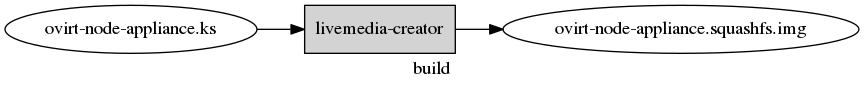

# Image build process

## Overview

## Specification

As `anaconda` is used for building the image, a kickstart file is used to specify how the image should look.

> Note: The kickstart defining the oVirt Node appliance is hosted in [oVirt's ovirt-appliance repository](https://gerrit.ovirt.org/gitweb?p=ovirt-appliance.git;a=blob;f=node-appliance/ovirt-node-appliance.ks;hb=HEAD)

An example kickstart can look like:

    lang en_US.UTF-8
    keyboard us
    timezone --utc Etc/UTC
    auth --enableshadow --passalgo=sha512
    selinux --permissive
    rootpw --lock
    user --name=node --lock
    firstboot --reconfig
    clearpart --all --initlabel
    bootloader --timeout=1
    part / --size=3072 --fstype=ext4 --fsoptions=discard
    poweroff
    
    %packages
    # config generic == not-hostonly, this is needed
    # to support make a generic image (do not keep lvm informations in the image)
    dracut-config-generic
    
    # EFI support
    grub2-efi
    shim
    efibootmgr
    %end

A few notes on the kickstart above:

* `dracut-config-generic` - Needed to create initramfs'es with broad hardware support
* `grub2-efi`, `shim`, `efibootmgr` - To provide EFI support within the image (these packages will not be installed by anaconda, because they are not required at build time, but they could be required at installation time).

**FIXME** The package requirements should go to some package dependencies, i.e. `ovirt-release-node-host`.

## Build

If the kickstart defining the appliance is available, the image can be built using the tooling in the `ovirt-appliance` repository:

    make image-build

# Build tooling: `image-tools`

The `image-tools` [repository](https://github.com/fabiand/image-tools) contains some tooling to build the appliance images.

This is very redundant to `livemedia-creator` and `koji`.

> FIXME this tool should be obsoleted by koji and livemdia-creator

## Deliveryformat

The appliance image is delivered in the squashfs liveimg format.

This format is understood by anaconda (for installation) and dracut (for state- and diskless boots).

The format is described in `man dracut.cmdline`:

    The filesystem structure is expected to be:

       squashfs.img          |  Squashfs downloaded via network
          !(mount)
          /LiveOS
              |- ext3fs.img  |  Filesystem image to mount read-only
                   !(mount)
                   /bin      |  Live filesystem
                   /boot     |
                   /dev      |
                   ...       |

> Note: the `ext3fs.img` is a file-system image, not a disk image.

The `ext3fs.img` can be created using a range of tools, the primary one being `livemedia-creator` (part of `lorax`).

[Eventually](https://bugzilla.redhat.com/show_bug.cgi?id=1282496) `livemedia-creator` will be capable of creating squashfs images directly.