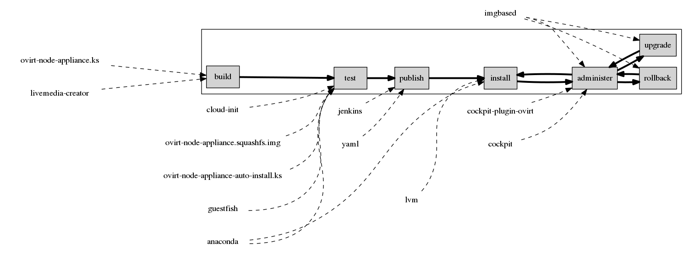
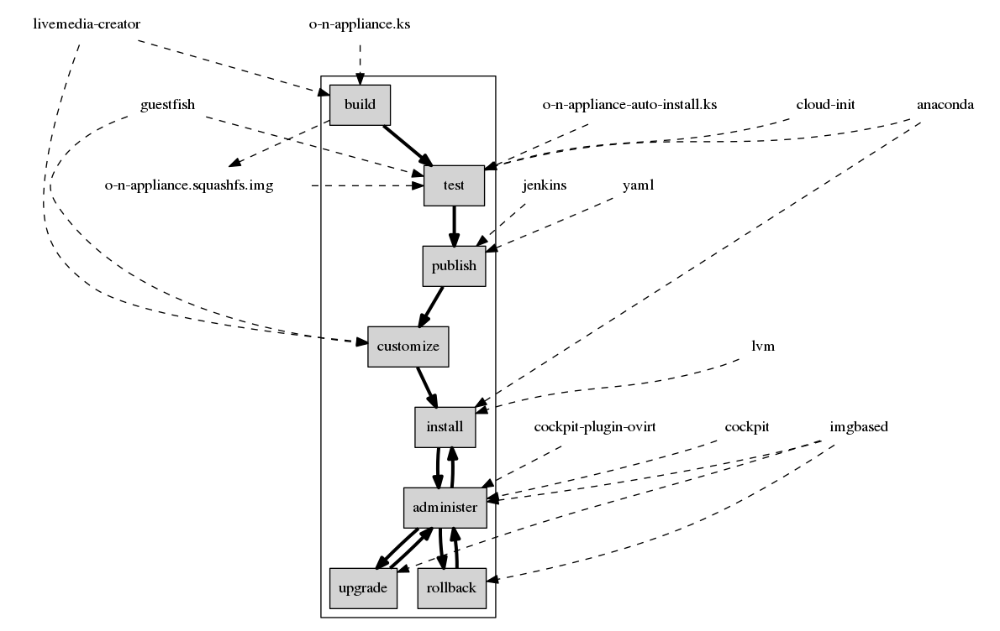

# Design

## Principles

A few principles provide the frame for the upcoming design decisions:

* Re-use existing and mature technologies (anaconda, lvm, cockpit)
* Fix upstream to fit our design
* Keep it simple
* Separate areas of responsibility (image vs installation vs image management & upgrade)

## Life-cycle Overview

Before diving into the technical details let us get overview over how the life of an image is envisioned. Once we are aware of this, we can see what components[^1] can be used to fill these stations.

[^1] When speaking of components, it is referred to another software project.

As seen in the diagram above, and image is build, tested and published. These actions are normally performed by a vendor or project, providing the image.

The image is **build** from a set of packages, normally consisting of a set of packages for the core operating system, and a couple of packages to provide the payload (in the oVirt case, vdsm is the payload).

The **testing** can be considered to perform some sanity tests to i.e.

- Ensure that the image is not corrupted,
- Essential packages are installed,
- But can also cover basic functional testing.

Once the image is good, it is **published** for further user consumption.

The remaining steps are the performed by users.

If a user needs extra packages inside the image, he can **customize** the image before installation.

Once he is satisfied, the image is **installed** onto a host and ready to use.

At runtime the image is **administrated** through a user friendly UI.

Eventually **upgrades** are available and get installed. These upgrades either end up successful or they fail. In case of a failure the **rollback** mechanism is used to roll back into the state prior to the upgrade, to return to a functioning system.

## Core technologies & concepts

In the light of the principles, the following (mainly) already existing technologies were choosen to realize the flows above:

* Build: livemedia-creator (or koji)
* Delivery format: liveimg compatible squashfs
* Customization: guestfish
* Installation: anaconda
* Upgrade & Rollback: imgbased and LVM
* Administration: Cockpit

The file-system layout and related concepts are not a technology, but are crucial for data persistence and the stability of upgrades and rollbacks.
The layout and concept is aligned to what other projects like [OSTree](https://github.com/GNOME/ostree) and ["Project Stateless"](http://0pointer.net/blog/projects/stateless.html) aim for.

### Image Format: Liveimg

Node is installed (and updated) using a single operating system image.
Contrary to many other distributions packages are not used to install the operating system. Packages are primarily used to [build the image](build.md), and eventually to [customize the image](impl.md).

The liveimg image format is a Fedora- and CentOS-ish format used to deliver LiveCDs.
A liveimg is a file-system image wrapped into a squashfs image.
The reasoning behind this matroska mechanism is that the file-system image can be mounted easily, and the squashfs image - as it can compress - is helping to reduce the size of the image.
Because it has been around for a long time, this format has mature support in dracut and anaconda.
This effectively enables two use-cases with one image:

* anaconda can use this image as a source instead of individual rpms
* dracut can boot into a liveimg

## Anaconda

Anaconda is the installer of Fedora, CentOS, and RHEL.
As stated above, anaconda can use the liveimg as an installation source. And thin provisioned LVm Logical Volumes can be used as an installation destination.

Anaconda does not need any modifications to provide the required functional of this design.
All other functionality of anaconda works without limitations.

## Upgrades & Rollback: imgbase

imgbase is the only new component with a larger code-base.
imgbase is actually a high-level frontend to LVM, enforcing a specific usage pattern.

In addition it has plugins to create boot entries for specific LVs, and some logic to migrate /etc from liveimg to liveimg.

## Filesystem layout and concepts

To especially let upgrades work correctly imgbase is making a few assumptions about file locations and how the filesystem is organized.
These concepts are well defined by OSTree and the Stateless project from systemd.

A few relevant main points are:

* Only /etc and /var are writable and persisted.
* Vendor presets/configuration goes to /usr/etc
* User configuration goes to /etc
* The user configuration overrides the vendor presets
* Partial configuration snippets can be placed in <conf>.d

The assumption is that these mechanisms above provide enough structure to build robust upgrades.

## Cockpit

[The cockpit project](http://www.cockpti-project.org) is building a web-based UI to administrate a host.

# Detailed Flow

Now that we are aware of all the components we can assign them to the specific flows.
The resulting diagram is shown below.
You might notice that the diagram contains a few previously unnamed components, no worries, we'll speak about them later on.

By now we assume that you got an idea of how the life-cycle of a Node looks, and what components are used in the specific flows.