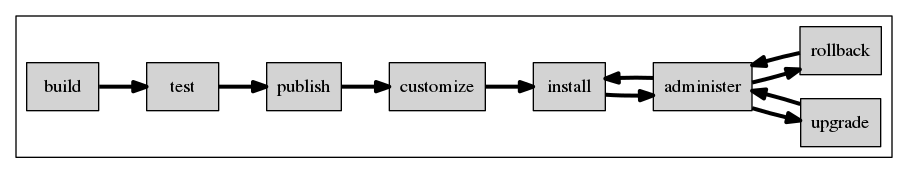

# Design

## Principles

A few principles provide the frame for the upcoming design decisions:

* Re-use existing and mature technologies (anaconda, lvm, cockpit)
* Fix upstream to fit our design
* Keep it simple
* Separate areas of responsibility (image vs installation vs image management & upgrade)

## Core technologies

In the light of the principles above, the following (mainly) already existing technologies are combined to achieve the aspired goals:

* Image format: liveimg
* Installation: anaconda
* Upgrade & Rollback: imgbased and LVM
* Filesystem layout and concepts: Like [OSTree](https://github.com/GNOME/ostree) and ["Project Stateless"](http://0pointer.net/blog/projects/stateless.html)
* Administration: Cockpit

The following diagram visualizes in what flows these technologies are used.

## Image Format: Liveimg

Node is installed (and updated) using a single operating system image.
Contrary to many other distributions packages are not used to install the operating system. Packages are primarily used to [build the image](build.md), and eventually to [customize the image](impl.md).

The liveimg image format is a Fedora- and CentOS-ish format used to deliver LiveCDs.
A liveimg is a file-system image wrapped into a squashfs image.
The reasoning behind this matroska mechanism is that the file-system image can be mounted easily, and the squashfs image - as it can compress - is helping to reduce the size of the image.
Because it has been around for a long time, this format has mature support in dracut and anaconda.
This effectively enables two use-cases with one image:

* anaconda can use this image as a source instead of individual rpms
* dracut can boot into a liveimg

## Anaconda

Anaconda is the installer of Fedora, CentOS, and RHEL.
As stated above, anaconda can use the liveimg as an installation source. And thin provisioned LVm Logical Volumes can be used as an installation destination.

Anaconda does not need any modifications to provide the required functional of this design.
All other functionality of anaconda works without limitations.

## Upgrades & Rollback: imgbase

imgbase is the only new component with a larger code-base.
imgbase is actually a high-level frontend to LVM, enforcing a specific usage pattern.

In addition it has plugins to create boot entries for specific LVs, and some logic to migrate /etc from liveimg to liveimg.

## Filesystem layout and concepts

To especially let upgrades work correctly imgbase is making a few assumptions about file locations and how the filesystem is organized.
These concepts are well defined by OSTree and the Stateless project from systemd.

A few relevant main points are:

* Only /etc and /var are writable and persisted.
* Vendor presets/configuration goes to /usr/etc
* User configuration goes to /etc
* The user configuration overrides the vendor presets
* Partial configuration snippets can be placed in <conf>.d

The assumption is that these mechanisms above provide enough structure to build robust upgrades.

## Cockpit
